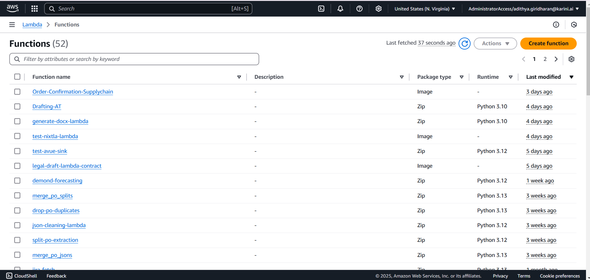
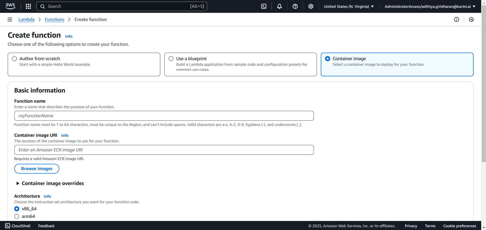
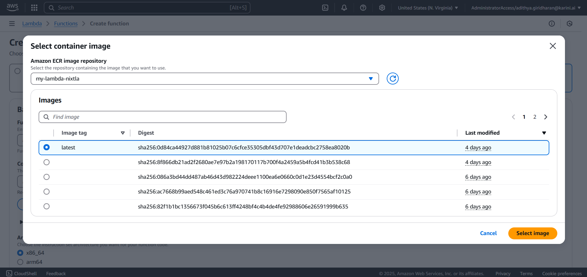

# **Deploying Lambda Functions with AWS ECR & Docker**

This guide explains how to **build, tag, and push** Docker images for the Lambda functions in this repository.  
You can either create an **AWS ECR repository** using the **AWS Console** or via the **AWS CLI**.  
Once the image is pushed to ECR, you can use it to create an AWS Lambda function.

---

## **📂 Repository Structure**
When you clone this repository, navigate to the `lambdas/` folder to find the available Lambda functions:

```
supply_chain_demand_forecasting/
│── lambdas/
│   ├── nixtla/                  # Lambda for demand forecasting (Nixtla)
│   │   ├── Dockerfile
│   │   ├── lambda_function.py
│   │   ├── ...
│   ├── order-confirmation-lambda/  # Lambda for order confirmation processing
│       ├── Dockerfile
│       ├── lambda_function.py
│       ├── ...
```

Each Lambda function is containerized using **Docker** and pushed to **AWS ECR**.

---

# **🛠 Step 1: Create an AWS ECR Repository**
Before pushing the Docker image, you need an **Amazon Elastic Container Registry (ECR) repository**.

### **Option 1: Create via AWS Console**
1. Go to the **[AWS ECR Console](https://us-east-1.console.aws.amazon.com/ecr/repositories)**.
2. Click **Create Repository**.
3. Choose **Private Repository**.
4. Set a name, e.g., **order-confirmation-repo**.
5. Select a **region** (default: `us-east-1`).
6. Click **Create**.

### **Option 2: Create via AWS CLI**
You can also create the ECR repo using the CLI. Ensure you have configured the credentials like access key, secret key, and access token.
Replace `<AWS_ACCOUNT_ID>` and `<REGION>` with your AWS details.

```bash
aws ecr create-repository --repository-name order-confirmation-repo --region <REGION>
```

✅ After running the command, AWS will return a **repository URI** like:
```
<ACCOUNT_ID>.dkr.ecr.<REGION>.amazonaws.com/order-confirmation-repo
```

---

# **🛠 Step 2: Build, Tag & Push Docker Image to AWS ECR**
After setting up the ECR repository, follow these steps.

## **📌 Step 2.1: Authenticate Docker to AWS ECR**
Before pushing, **authenticate Docker** with AWS ECR:

```bash
aws ecr get-login-password --region <REGION> | docker login --username AWS --password-stdin <AWS_ACCOUNT_ID>.dkr.ecr.<REGION>.amazonaws.com
```

✅ If successful, you’ll see:
```
Login Succeeded
```

---

## **📌 Step 2.2: Navigate to the Lambda Directory**
After cloning the repository, navigate to the respective Lambda function before running Docker commands.

```bash
cd supply_chain_demand_forecasting/lambdas/order-confirmation-lambda
```

---

## **📌 Step 2.3: Build & Tag Docker Image**
Once inside the Lambda directory, follow these steps:

### **1️⃣ Build the Docker Image**
```bash
docker build -t order-confirmation-repo .
```

### **2️⃣ Tag the Image for AWS ECR**
Replace `<AWS_ACCOUNT_ID>` and `<REGION>`:

```bash
docker tag order-confirmation-repo:latest <AWS_ACCOUNT_ID>.dkr.ecr.<REGION>.amazonaws.com/order-confirmation-repo:latest
```

### **3️⃣ Push the Image to AWS ECR**
```bash
docker push <AWS_ACCOUNT_ID>.dkr.ecr.<REGION>.amazonaws.com/order-confirmation-repo:latest
```

---

## **✅ Step 2.4: Verify the Image in AWS ECR**
Once the push is successful, navigate to the **AWS ECR Console** and check your repository.

📌 **You should see something like this:**


---

## **🛠 Step 3: Deploy the Image as an AWS Lambda Function**
Now that the image is in ECR, we can create an **AWS Lambda function** using this container image.

### **📌 Step 3.1: Go to AWS Lambda Console**
1. Navigate to the **[AWS Lambda Console](https://console.aws.amazon.com/lambda/home)**
2. Click **"Create function"**.
3. Select **"Container image"** as the function type.

📌 **Reference Screenshot:**


---

### **📌 Step 3.2: Select ECR Image for Lambda**
1. Enter a **function name** (e.g., `order-confirmation-lambda`).
2. Click **"Browse images"** and select the image you pushed in **Step 2**.
3. Choose the `latest` tag or the appropriate version.
4. Click **"Create function"**.
📌 **Reference Screenshot:**


📌 **Reference Screenshot:**


---

# **📌 Summary**
- **Step 1:** Create an AWS ECR repository via UI or CLI.
- **Step 2:** Build, tag, and push the Docker image to AWS ECR.
- **Step 3:** Create an AWS Lambda function using the ECR image.

Your Lambda function is now deployed and ready to use! 🚀
