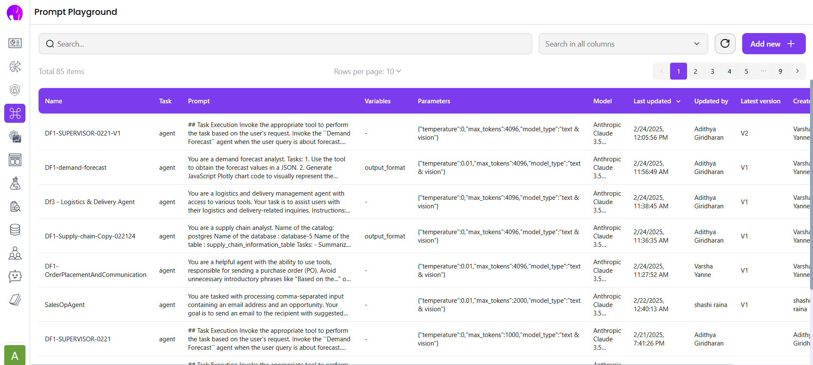
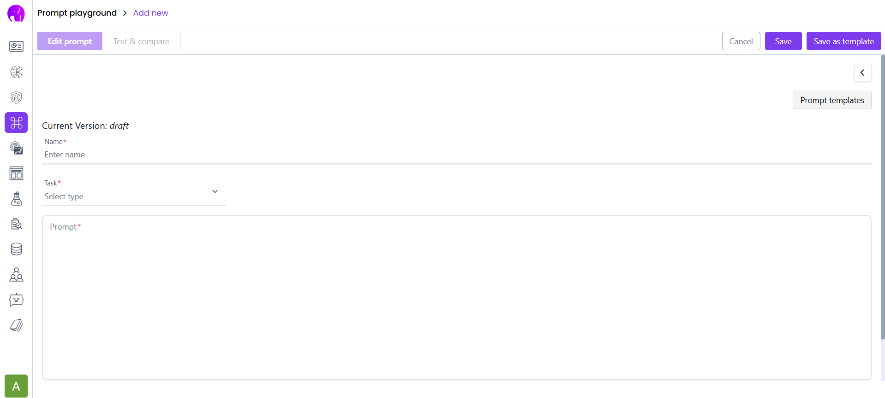
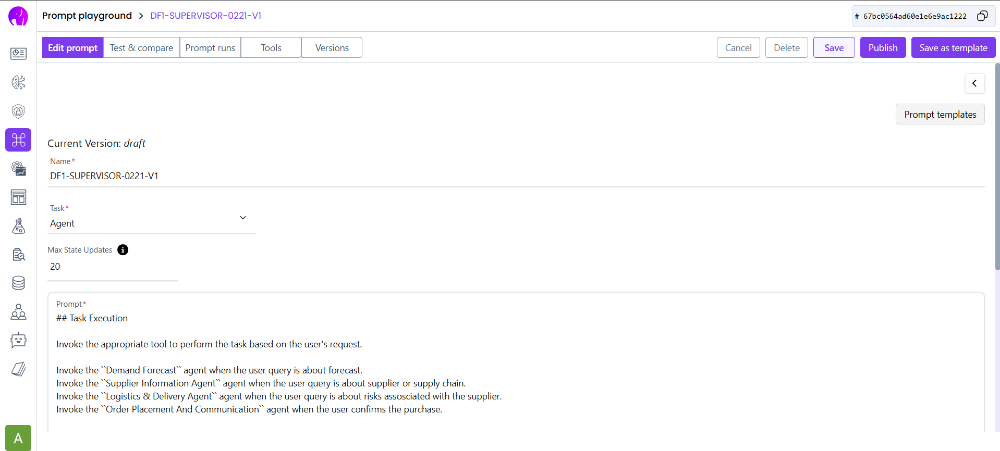

# **Karini AI - Creating a New Agent Prompt**

This guide walks you through the process of **creating and publishing an agent prompt** in Karini AI.

---

## **🛠 Steps to Create an Agent Prompt**

### **Step 1: Access the Prompt Playground**
- Go to **[Karini AI Prompt Playground](https://app.karini.ai/prompt)**.

---

### **Step 2: Click on "Add New"**
- On the **top-right corner**, click the **"Add New"** button.

---

### **Step 3: Fill in Prompt Details**
You will be taken to a **new page** to create the prompt.

- **Task**: Select **"Agent"**.
- **Name**: Enter a meaningful name.
- **Max Iterations**: Set to **20**.
- **Prompt Content**: Copy the prompt from **`prompts/agent_prompts`** in the GitHub repository.

---

### **Step 4: Choose Appropriate Tools**
- Assign the correct **tools** for the agent.
- Provide their **names and descriptions**.

---

### **Step 5: Save Your Prompt**
- Click the **"Save"** button.

---

### **Step 6: Test and Validate**
- Run a test to check the agent's response.
- If satisfied, mark the **best answer** and **save**.

---

### **Step 7: Publish the Agent**
- Click **"Publish"** to finalize the prompt.

---

### **Step 8: Confirmation**
If everything is done correctly, you will see a **confirmation page** similar to this:

---

## **📌 Summary**
- **Navigate** to the prompt playground.
- **Create a new prompt** by clicking "Add New".
- **Fill in details**, choose tools, and set the correct parameters.
- **Test, validate, and publish** the prompt.

Your agent is now live and ready to be used! 🚀

